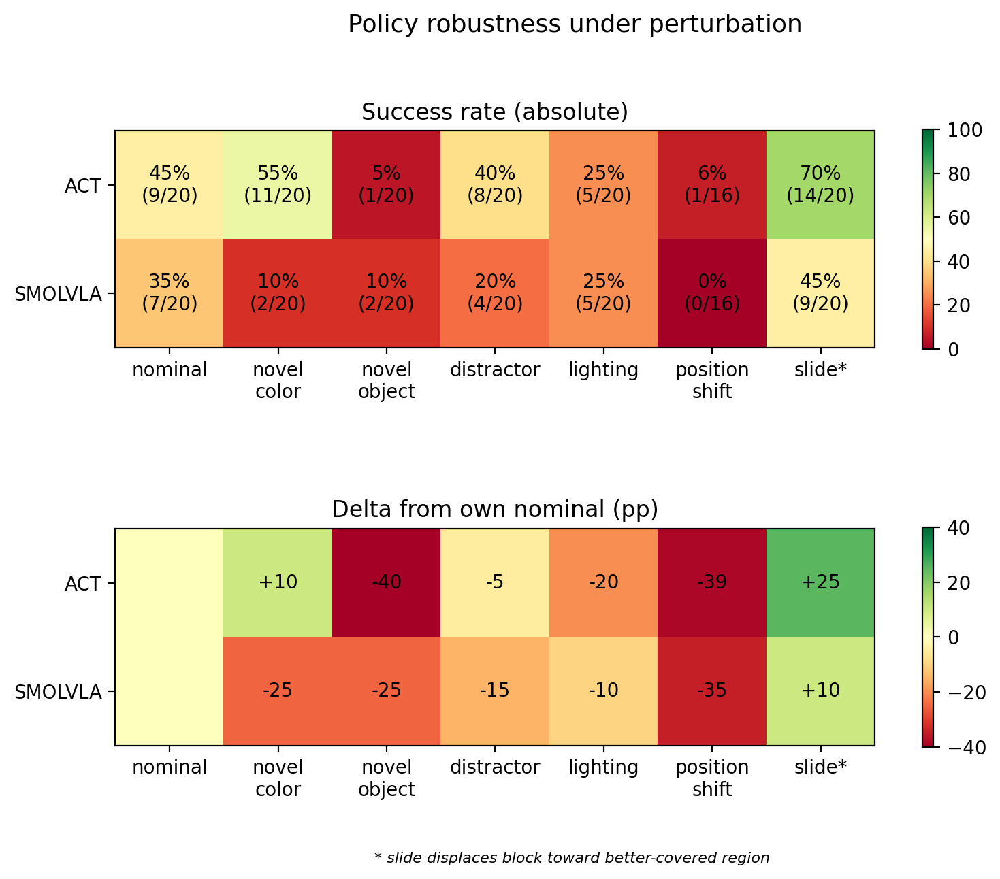

# ACT vs Diffusion vs SmolVLA: How imitation learning policies generalize beyond their demonstrations

Over the past couple of years I have been impressed by what imitation learning can get robots to do from demonstrations alone - folding laundry, tying trash bags, and more. This raised a question **how do different imitation learning approaches, trained on identical demonstrations, compare in their learned behavior, generalization, and failure modes?**

To explore that question, I trained three policies on an SO-101 arm: ACT and Diffusion, both trained from scratch, and SmolVLA, a pre-trained model fine-tuned for this experiment. All three were trained on **the same frozen dataset of only 50 pick and place demonstrations**. ACT and SmolVLA were then evaluated on real hardware across a grid of six perturbations (272 scored trials). Diffusion was evaluated under nominal conditions only, as deployment constraints prevented evaluation across the perturbation grid (see Diffusion section below). Goal of this work was not just to compare success rates, but to understand **what each policy learned from the same limited data, how well that behavior generalized, and what their specific failures reveal about their strengths and weaknesses.**

**TLDR:** 
- **Two policies seem to learn different features from the same data.** ACT appears to rely more on object shape than color, while SmolVLA is more sensitive to color (partially through the task string, but also through its visual model; see follow-up results below). In terms of trajectory, ACT seems to operate more on “autopilot,” often reproducing an “average” of the training trajectories, whereas SmolVLA appears more reactive to its visual observations. Both policies show that positional control could be significantly improved with better training data coverage (supported by the SmolVLA follow-up results below). 
- **At first glance, the attempt statistics suggest a quantity vs quality tradeoff:** ACT makes more grasp attempts, while SmolVLA converts each attempt better. Follow-ups complicate that framing. ACT’s extra attempts largely come from replaying an averaged trajectory through the middle of the training start region, leading to more accidental collisions with the block — persistent, but not aimed. SmolVLA’s attempts are aimed but imprecise: increasing its attempt rate through async inference did not improve success, while better training data coverage did. 
- **Diffusion Policy, evaluated under nominal conditions only, qualitatively showed the most within episode adaptation**, visibly correcting its approach rather than replaying an averaged trajectory. However, deployment never reached a stable enough operating point to evaluate it under perturbations.

*Video of novel object pickup with ACT (left) and SmolVLA (right). Both policies were trained on the same pink block, which is replaced here by a pink sock. ACT oscillates between the training start region and target tray without engaging with the sock, behaving as if it does not register the target object in either location. SmolVLA, in contrast, localizes the sock and attempts a grasp, nearly succeeding — suggesting better visual generalization to the novel object.*

## Key takeaways
- **Nominal success rates hide the differences.** Under nominal conditions, ACT and SmolVLA have similar success rates (45% vs. 35%), while Diffusion is lagging behind (10% pick and place, 25% pick-up) — though its numbers reflect a constrained deployment more than the policy itself (see Diffusion section). But *how* these policies fail already reveals differences between them, and these become much clearer under conditions none of them saw in training.
- **Training data is the most important success factor.** As expected, and consistent with where much of the field is focused, training data that covers the range of possible conditions strongly affects success. Shifting the target object just a few centimeters outside the training start region drops both ACT and SmolVLA policies to ~0% (1/16 and 0/16). ACT gets more accidental collisions with the target, while SmolVLA partially localizes it but cannot construct a grasp out of distribution. In follow-up, 16 additional demos covering the edges of the start region and more wrist angles (without using any tested nominal positions) was the single intervention that significantly improved SmolVLA — 35% → 55% from a 32% increase in data.
- **Color vs. shape.** Policies rely on different visual features. A different color block drops SmolVLA from 35%→10% while leaving ACT unchanged. Different shape (pink block → pink sock) does the opposite — ACT fails to register the sock as a target in 16/19 trials, while SmolVLA still localizes and reaches it. Follow-up test with the instruction matching the actual color recovers part but not all of SmolVLA's drop, so the color sensitivity enters partly through the task string and partly through the visual model.
- **Re-planning does not necessarily mean re-targeting.** In the mid-reach slide condition, ACT and SmolVLA re-plan on comparable timescales (ACT re-plans every ~3.4 s — full 100-step chunk plus 35ms inference; SmolVLA every ~2.7 s — 50-step chunk plus ~1 s inference). Yet after receiving a new observation, ACT continues toward the familiar location while SmolVLA adjusts its trajectory toward the moved object. The difference therefore seems to be in how each policy uses the new observation, rather than simply how often it re-plans.
- **Quantity vs quality of attemps.** From joint traces, ACT makes ~1.8× more grasp attempts per episode, while SmolVLA converts each attempt better (0.28 vs. 0.20). This first read like a quantity vs quality tradeoff, but the follow-up tests show different picture: ACT's extra attempts are largely accidental sweeps of an averaged trajectory, and SmolVLA's limit is precision, not opportunity — running it asynchronously raised its attempt rate but not its success, while better data coverage raised success.
- **Deployment can dominate evaluation.** Diffusion's low nominal score reflects its deployment constraints more than the policy itself. At ambiguous moments, consecutive action chunks can disagree on *when* to move, producing large command discontinuities — severe enough, without clamping, to damage the arm. Therefore, safety clamp limiting how much each joint angle can change per step was added, but this affected arm's rise and made it slower, leaving less time to interact with the object within the 30 s episode, which reduced success rate. Once near the object, grasp positioning and wrist adaptation look the most competitive, suggesting manipulation is not the main bottleneck, deployment is (see Diffusion section).

## Method

| Deployment configuration | ACT                          | Diffusion Policy                              | SmolVLA                                |
|--------------------------|------------------------------|-----------------------------------------------|----------------------------------------|
| Parameters               | ~52M                         | ~263M                                         | ~450M                                  |
| Init                     | scratch                      | scratch (ImageNet backbone)                   | fine-tuned from robot-pretrained VLM   |
| Conditioning             | 1 frame + joints             | 2 frames + joints                             | 1 frame + joints + task string         |
| Action generation        | one forward pass, chunk 100  | iterative denoising (DDIM-50), 64 → exec 32   | autoregressive/flow head, chunk 50     |
| Deployed inference       | ~35 ms local (M1)            | ~430 ms remote A10                            | ~1 s local (M1)                        |
| Deployment extras        | —                            | `max_relative_target=8` clamp                 | —                                      |

- **Hardware:** SO-101 leader/follower arm pair, single front facing camera (positioned across from the follower), LeRobot v0.6.1.
- **Dataset:** 50 teleoperated pick and place demos, frozen before any training ([`so101_policy_robustness`](https://huggingface.co/datasets/TamaraSumarac/so101_policy_robustness)). All perturbation comparison results use this dataset only. For the coverage follow-up, 16 additional demos exploring the edges of the start region and a wider range of wrist angles (deliberately excluding the nominal positions used in the eval) were collected as [`so101_policy_robustness_v2`](https://huggingface.co/datasets/TamaraSumarac/so101_policy_robustness_v2) and used to retrain SmolVLA.
- **Policies:** LeRobot default configurations throughout. ACT and Diffusion Policy trained from scratch; SmolVLA fine-tuned from its pre-trained checkpoint. Diffusion deployed with DDIM-50 and a `max_relative_target=8` safety clamp (see Diffusion section).
- **Eval:** perturbation protocol details ([protocol](perturbation/perturbation_protocol.md)) — nominal conditions for all three policies (20 trials each); the perturbation grid of 6 new conditions (position shift, novel color, pink sock distractor, lighting, novel object, mid-reach slide) × 20 trials (16 for position shift) for ACT and SmolVLA. Binary scoring, fixed trial order, no discards. Failure/success taxonomy coded per trial; attempt counts measured from joint traces. Follow-up experiments (task-string probe, async inference, v2 retrain) described in their section below.

## Results:

Full analysis of ACT and SmolVLA comparison in [perturbation/perturbation_results.md](perturbation/perturbation_results.md): per condition results, failure mode and success mode analysis, joint trace based attempt/conversion analysis, experiment hypothesis discussion. Raw trial log and analysis notebook in [`perturbation/`](perturbation/).

## Follow-up work
- **Task-string probe for SmolVLA:** Matching the task string to the novel color doubled success (10% → 20%) and eliminated the "block not registered" failure mode — remaining failures were SmolVLA's usual precision errors. This didn't fully recover the nominal result (35%), so color sensitivity enters partly through the instruction and partly through the visual model. Full results in [smolvla_novel_color_task_string.md](perturbation/follow-up%20results/smolvla_novel_color_task_string.md).
- **Async inference for SmolVLA:** Grid results suggested that SmolVLA could be latency limited and that raising number of pick-up attempts could raise success substantially (~60% at its 0.28/attempt conversion, if attempts reached ACT's rate). Async inference raised attempts by 28%, but success didn't move (30% vs. 35% nominal) — refuting the quantity of attemps hypothesis. The traces suggest why: ACT's extra attempts often shove the block into easier pickup positions by accident, while SmolVLA's extra attempts re-adjust to the object often without displacing it — more deliberate, but still limited by positioning precision. Full results in [smolvla_remote_inference.md](perturbation/follow-up%20results/smolvla_remote_inference.md).
- **More and better data coverage improves SmolVLA:** 16 additional demos covering the edges of the start region and wider wrist angles (none at the tested positions or angles) raised nominal success from 35% to 55%, with the clearest gain in wrist-angle handling (e.g. the 135° grasp the v1 model never managed). Full results in [smolvla_more_demo_data.md](perturbation/follow-up%20results/smolvla_more_demo_data.md).

## Diffusion

Diffusion took the longest to get to the point where it could even take nominal data — the work split into making it fast enough, then making it safe enough, then measuring what remained. Full detail in [debugging_diffusion_ctnd.md](perturbation/follow-up%20results/diffusion/debugging_diffusion_ctnd.md).

- **Too slow to deploy with the training scheduler.** Using the same DDPM scheduler as during training (100 U-Net denoising steps), inference took ~9 s per chunk on my M1 Mac, while each chunk contained only ~1.07 s of executed motion (32 actions at 30 Hz). Following the paper's own approach ([Chi et al., 2023](https://arxiv.org/abs/2303.04137), §3.4), the sampler was switched to DDIM at inference, which uses the same trained model but reaches the final action prediction in fewer denoising steps. Reducing from 100 to 10 steps brought inference down to ~0.9 s per chunk.
- **Deployable but too violent - arm broke.** DDIM-10's inference was deployable now, but on hardware motion was jerky enough to detach the gripper motor. Offline analysis of predicted chunks located the cause at chunk boundaries: at ambiguous moments (e.g. hovering before a grasp) the model has several valid options for *when* to move, and two consecutive chunks can pick different ones — the handoff between them is a commanded jump. The effect is not specific to DDIM — the same discontinuities persist with DDIM-50 and DDPM-100, and similar frames appear in ACT. However, ACT executes its full 100-step chunk (~3.3 s open-loop, ~3× Diffusion's commitment) without the same instability. Its consecutive predictions are more consistent, suggesting that long action chunks are not the main problem, large disagreement between consecutive plans is.
- **Made safe with a permanent clamp, made responsive with cloud inference.** Applied motion clamp (`max_relative_target=8`) to turn those jumps into bounded per-step motion - making it hardware safe, and moving inference to a remote A10 cut it to ~0.43 s per chunk (mostly transport: JPEG-compressed observations + round-trip). Details in [eval_nominal_diffusion.md](perturbation/follow-up%20results/diffusion/eval_nominal_diffusion.md).
- **Settled config: DDIM-50, clamp 8, full-chunk execution.** DDIM-50 gave the smoothest motion of the samplers. Offline analysis suggested that shorter commitments should reduce chunk-boundary discontinuities, so `chunk_size_threshold` was used to trigger earlier re-planning, down to ~20-step commitments. Contrary to expectation, full 32-step execution worked best. One possible explanation is that each new chunk is then planned from a stationary arm, while early re-planning produces the next chunk from an observation taken mid-motion that is already ~0.5 s stale by the time it is executed.
- **Result: 25% pick-up, 10% pick and place.** Main success limitation was the time required for the arm to rise under the safety clamp. In 6/20 episodes, the arm never got up, in ~7 more, the rise took roughly half of the 30 s episode, leaving limited time for interaction. Once near the object, however, Diffusion showed accurate grasp positioning and visible wrist adaptation to block orientation, resulting in 5 successful pickups (3 ran out of time before drop-off). This suggests that the low success rate is driven primarily by the constrained deployment rather than manipulation performance itself. *(The homing routine also required adjustment under the clamp, the first evaluation run was excluded because episodes started from inconsistent poses.)*

## Next steps

All of these are aimed at making Diffusion deployable enough to test it on perturbation scenarios:

**Adjusting inference on the currently trained model:**

1. **Shorter executed horizon on the current model.** Offline seam analysis says seams grow with commitment length, so test n_exec = 16 and 8 (slicing the same 64 step prediction — no retraining). Idea is that faster replan may cause smaller jumps, that may tolerate a looser clamp, and a looser clamp should speed up the rise phase that currently eats episode budget. One thing that could prevent this from working: at ~0.43 s inference, and n_exec = 16 would make execution ~0.5s, making "doing" vs "waiting" ratio worse, so we may need to implement async inference to fight this.
2. **Boundary blending between chunks.** Inspired by ACT's temporal ensembling (proposed in ACT paper, off in this deployment): instead of switching hard from one chunk to the next, cross fade the handoff using the discarded tail of the outgoing chunk — no retraining, and it targets the seam mechanism directly, which could let the global clamp loosen and speed up the rise phase.

**Retraining the model:**

3. **Retrain at horizon 32.** U-Net denoises full 64-step trajectory every pass, so halving the horizon makes each pass faster. On my setup this win is likely modest — inference is already ~0.43 s remote, much of it Mac↔cloud transport that a smaller model doesn't touch — but it moves the config toward the paper's operating point (their deployments predict 16, execute 8).
4. **Retrain on the v2 dataset (66 demos).** Diffusion is the most data-hungry of the three policies, and the same 16-demo coverage addition moved SmolVLA 35% → 55%. If precision at grasp is limiting Diffusion the way it limited SmolVLA, this could be the cheapest large win available.

If these bring Diffusion's nominal into ACT/SmolVLA territory, I would take perturbation grid on diffusion as well for comparison with ACT/SmolVLA.

## Connection to earlier work
This is a hardware follow-up to my [domain-randomization ablation study](https://github.com/TamaraSumarac/dr-ablation-study) on a simulated Unitree Go2. Both studies explore a similar question: **nominal performance alone does not tell us much about what a policy learned — the differences become much clearer when we test policies in conditions they never explored in training.** In simulation, policies trained with and without individual domain randomizations performed similarly under nominal conditions, but differences emerged once the physics was perturbed. Here, ACT and SmolVLA are trained on identical data and again show relatively similar nominal performance, while perturbing the scene reveals very different learned behaviors.

There is another similarity between the two studies: looking at only one perturbation at a time would miss some of the more interesting results. In simulation, this revealed an interaction between friction and joint stiffness/damping; here, testing both color and shape changes shows that the two policies seem to rely on different visual features. Similarly, the most obvious explanation is not always the right one: more randomization was not necessarily better in simulation, and faster inference does not necessarily lead to better re-targeting here.

## Repo map

| Path                                          | What                                                    |
|-----------------------------------------------|---------------------------------------------------------|
| `perturbation/perturbation_protocol.md`       | Frozen pre-registered eval protocol                     |
| `perturbation/perturbation_results.md`        | Full results + hypothesis verdicts                      |
| `perturbation/trial_log.xlsx`                 | Per-trial log: scores, failure notes, episode indices   |
| `perturbation/DataAnalysis.ipynb`             | Heatmaps, taxonomy coding, attempt analysis             |
| `perturbation/videos/`                        | Result clips pulled from eval episodes                  |
| `perturbation/follow-up results/`             | Follow-up experiments: task-string probe, async inference, v2 retrain, Diffusion debugging + Diffusion results + signal analysis |
| `act/`, `smolvla/`, `diffusion/`              | Per-policy training/eval configs and notes              |
| `checkpoints_*_baseline/`, `checkpoints_smolvla_v2_66ep/` | Trained checkpoints incl. scheduler variants (config-edited copies) |
| `so101_policy_robustness/`, `..._v2/`         | Local copies of the training datasets (also on HF Hub)  |
| `training/`                                   | Training launcher (ACT / Diffusion / SmolVLA, with per-episode trims) |
| `tools/`                                      | Eval launchers, calibration gate, rollout scripts       |
| `rig/`                                        | Hardware setup and collection protocol                  |
| `trim/`                                       | Per-episode head/tail trim definitions                  |
| `logs/`                                       | Eval session logs                                       |

Eval rollout datasets (all 272 episodes, video + joint traces): [HF Hub](https://huggingface.co/TamaraSumarac) under `rollout_*`.