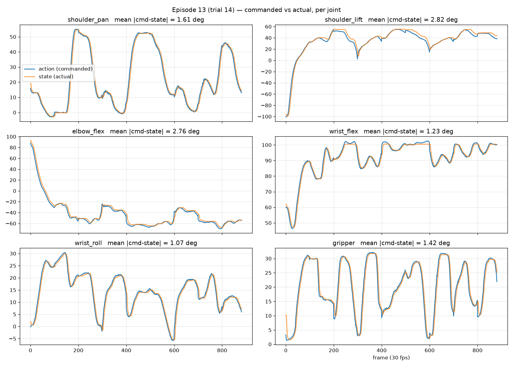
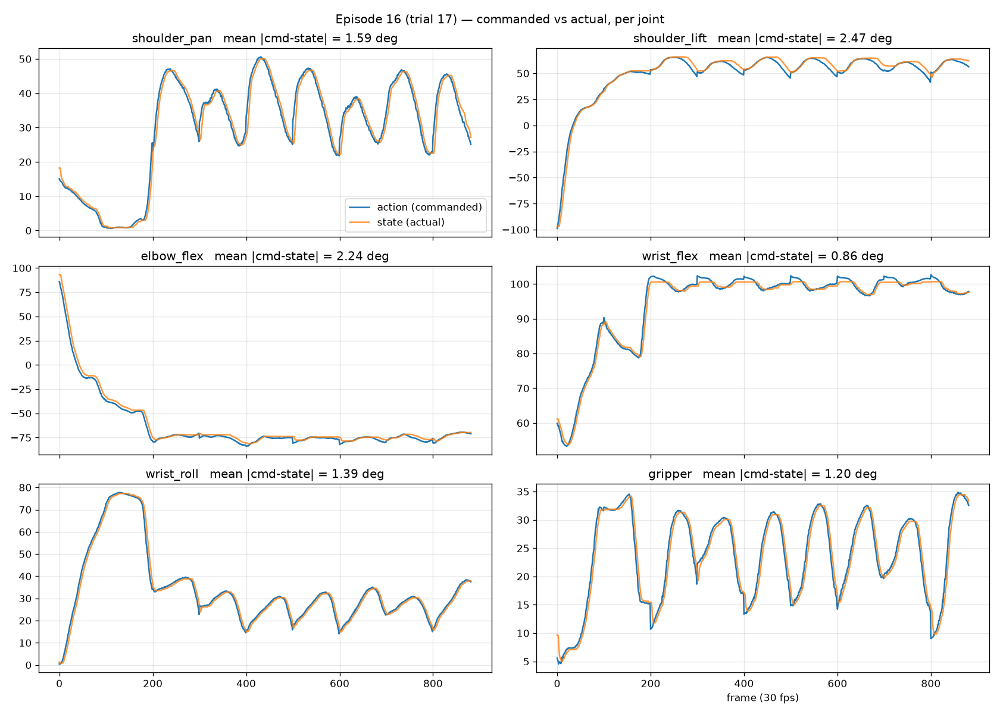
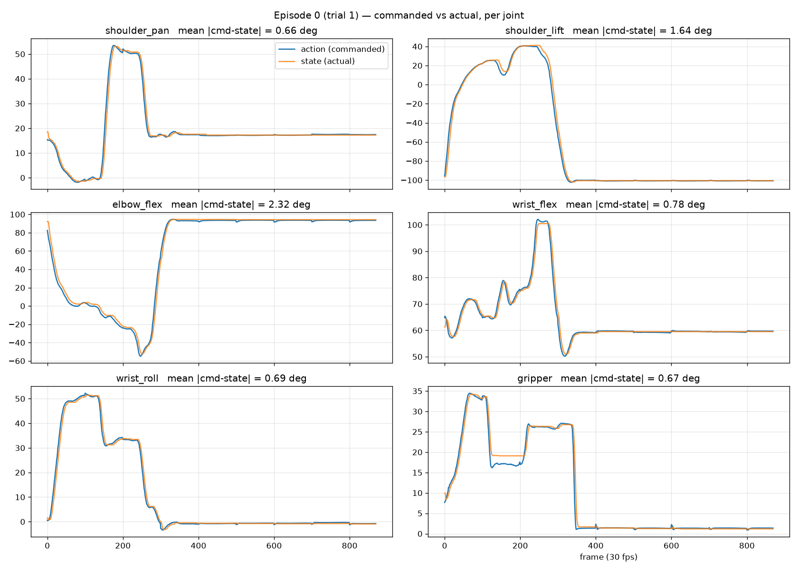

# Results — ACT Baseline, Nominal

## TLDR
- Nominal success: 9/20 (45%) on frozen 5×4 grid, 30 s budget
- Checkpoint: 100000 (final), dataset @ e2dd884 (trimmed)
- Verdict: GO - proceed to Diffusion Policy

## Failure categories — 11 failed trials (one per trial = earliest event the trial did not recover from, judged from video)

| Category            | Definition                                                                              | Count | Trials                    |
|---------------------|-----------------------------------------------------------------------------------------|-------|---------------------------|
| reached wrong spot  | gripper descended/closed at a visibly wrong location (e.g. went to middle)              | 7     | 3, 5, 7, 12, 13, 14, 15   |
| closed on nothing   | gripper at roughly the right spot, but fingers closed without securing block (air/edge) | 0     |                           |
| tipped block        | contact tipped or knocked the block over instead of grasping it                         | 1     | 8                         |
| pushed block away   | contact pushed the block out of the start region / out of camera view                   | 3     | 10, 17, 18                |
| dropped in transit  | block secured, then lost between pickup and plate                                       | 0     |                           |
| missed plate        | block carried and released, but came to rest outside/on the rim of the plate            | 0     |                           |
| never moved/stalled | arm froze or never approached                                                           | 0     |                           |

**Observation:** all three failed categories observed share one upstream event — the gripper arrives at a
wrong position before contact. Push and tip events occur *during* mispositioned contact; no failure
occurred after a secure grasp (0 drops, 0 missed plates). The policy's entire failure happen before the fingers close.

**Recovered trials (failed attempt(s), then succeeded within budget) — not in tally above:**
- Trial 4: tipped the block in a way that incidentally improved its graspability; succeeded on retry
- Trial 16: tipped the block on attempt 1; grasped successfully on attempt 2
- Trial 19: dragged/pushed the block from top toward center on attempt 1; grasped on attempt 2

## Failure category × position (11 failed trials; cell = count)

| Position     | reached wrong spot | tipped block | pushed block away | Total failed | (of N trials) |
|--------------|--------------------|--------------|-------------------|--------------|---------------|
| Center       |                    |              |                   |              | 0/4            |
| Top left     |          2         |              |         1         |              | 3/4            |
| Top right    |          2         |       1      |         1         |              | 4/4            |
| Bottom left  |          1         |              |                   |              | 1/4            |
| Bottom right |          2         |              |         1         |              | 3/4            |

## Failure category × orientation (11 failed trials; cell = count)

| Orientation | reached wrong spot | tipped block | pushed block away | Total failed | (of N trials) |
|-------------|--------------------|--------------|-------------------|--------------|---------------|
| 0°          |          2         |              |                   |              | 2/5            |
| 45°         |          1         |       1      |         1         |              | 3/5            |
| 90°         |          4         |              |                   |              | 4/5            |
| 135°        |                    |              |         2         |              | 2/5            |

## Commanded vs actual traces (policy error vs tracking error)

To determine whether failures come from the policy commanding wrong actions or the
controller failing to execute them, commanded action was overlaid against observed
state per joint for representative episodes (`plot_traces.py`).

**Episode 13 (trial 14 — bottom left, 90°, reached-wrong-spot):** tracking is
doing a good job: mean |command − state| between 1.1° and 2.8° across all six
joints, with state following command at a small consistent lag. The three grasp
attempts are directly visible in the traces (three large shoulder_pan excursions
with matching gripper open/close cycles). Interestingly, shoulder_pan returns to roughly the
same ~50° neighborhood on every attempt — basically "goes to the middle" failure we saw in videos as well. 
This confirms that commanded trajectory itself aims at the wrong location; the controller executes it correctly.

Two tracking imperfections were observed, neither coinciding with failure events:
- Shoulder_lift shows transient 5–10° lags during fast, extended reaches — the
joint working under the largest gravitational load and catches up each time
- Wrist_flex saturates at its ~100° limit: commanded values occasionally exceed 100° but state clips flat at the limit. 
This is not a tracking failure — below the limit, following is good (mean gap 1.23°)

**Episode 16 (trial 17 — top left, 135°, pushed-block-away):** same tracking
signature as episode 13: (mean |command − state| 0.86–2.47°
across joints). Both hardware envelope patterns appear here as well: shoulder_lift's
transient sag during extended reaches (~50–60°) and wrist_flex riding its 100°
limit with commands poking slightly above throughout the grasp phase — appearing
here in a different failure category, consistent with these being properties of
the hardware rather than of failures. Note, failure structure in joint looks different from trial 14: instead of
committed excursions toward (a wrong) grasp location, the traces show ~6–7
smaller shoulder_pan oscillations with rapid gripper open/close cycles. The
video identifies this as the arm cycling between the target plate and the edge
of the plate region after the block was pushed away — repeatedly initiating a
return toward the pickup side but turning back at the boundary, never
re-reaching the pickup station. Even though the push happened, no effect is visible in any joint's observed state, i.e. the contact did not measurably disturb the arm.

**Episode 0 (trial 1 — center, 0°, success; reference):** tracking of the
three episodes in line with other episodes (mean |command − state| 0.66–2.32°). 
Task structure is directly visible in the traces: one shoulder_pan excursion to the block, one grasp,
transport, release, then all joints flat for the remaining ~17 s of budget. Both
hardware envelope patterns appear mildly here as well (shoulder_lift sag during
the loaded move, wrist_flex briefly at its 100° limit) — confirming these are
properties of the hardware, not failure signatures. Note, the gripper shows a
sustained ~2° command vs state offset exactly while the block is held (frames
~120–340): the fingers are commanded to close past the block's width, and that
position error is what generates the grip force. The offset vanishes at release.
A sustained gripper gap is therefore a "block in hand" signal readable from the
traces alone — absent in episode 13's three failed grasp cycles.

**Takeaway:** failures are policy errors, not tracking errors. The control stack
executes commanded trajectories with degree-level fidelity; in failed trials the 
commands themselves direct the gripper to the wrong location. This localizes the problem entirely in the learned policy /
training data, not in deployment.

## Interpretation

Traces rule out deployment: commands executed with degree-level fidelity, so the
failures are about what policy learned, consequence of training data.

**Main mechanism: the policy reaches toward the training distribution's mode.**
7/11 failures are reached wrong spot, and the wrong spot is the middle of the
workspace — where most demos placed the block. Clearest at 90°: all 4 failures
are clean misses at a distance, and in episode 13 shoulder_pan returns to the
same ~50° neighborhood on all three attempts. 90° isn't hard because of the
wrist angle (that pose is near resting so should be the easiest from this motor perspective) — 
it's hard because it places the block far from the training mode, and the commanded trajectory goes toward the mode rather than the block.

**Everything fails before the grasp; nothing after.** 0 drops, 0 missed plates,
0 stalls — once the block is in hand the policy is essentially perfect. The
problem is exclusively pre-grasp positioning at off mode placements, with
kinematic difficulty stacking on top (top right = distance from mode + wrist
rotation demand: the only 0/4 cell).

**Recovery is real, observation-driven, but short-leashed.** Retries do track the
block: in trials 4, 16, 19 the block was tipped or pushed to a new spot and the
gripper followed it there. But the tracking has limited range, centered on the
workspace middle — it works when the block stays near the training mode, and
degrades with distance: far placements get clean misses toward the middle (the
90° row), displaced blocks near the edge get oscillation rather than pursuit
(trial 17). The policy follows the block on a leash anchored to the training
distribution.

**Prediction:** if the bottleneck is data coverage (not architecture), adding demos
at the failing cells should fix them — logged as a future probe in ideas.md. More
immediately: Diffusion and SmolVLA will be evaluated on this same grid, and whether
they do better on the 90° row is worth watching — written down here, before running
them.

## Go/no-go reasoning
- **GO** — continue to Diffusion and SmolVLA on the same dataset and eval grid.
- We have 45% success rate, and the failures are explainable: training data placed the
  block mostly around the middle, and failures happen at the edges of the workspace,
  where the policy still reaches toward the middle.
- The dataset clearly supports learning where coverage exists: center 4/4, and zero
  failures after grasp.
- Open question for the next two policies: Can Diffusion or SmolVLA handle these edge
  cases better?

## Frozen for comparison
- Eval grid: 20 cells as defined in eval_nominal_act.md
- Same budget, criterion, camera, scoring for Diffusion and SmolVLA