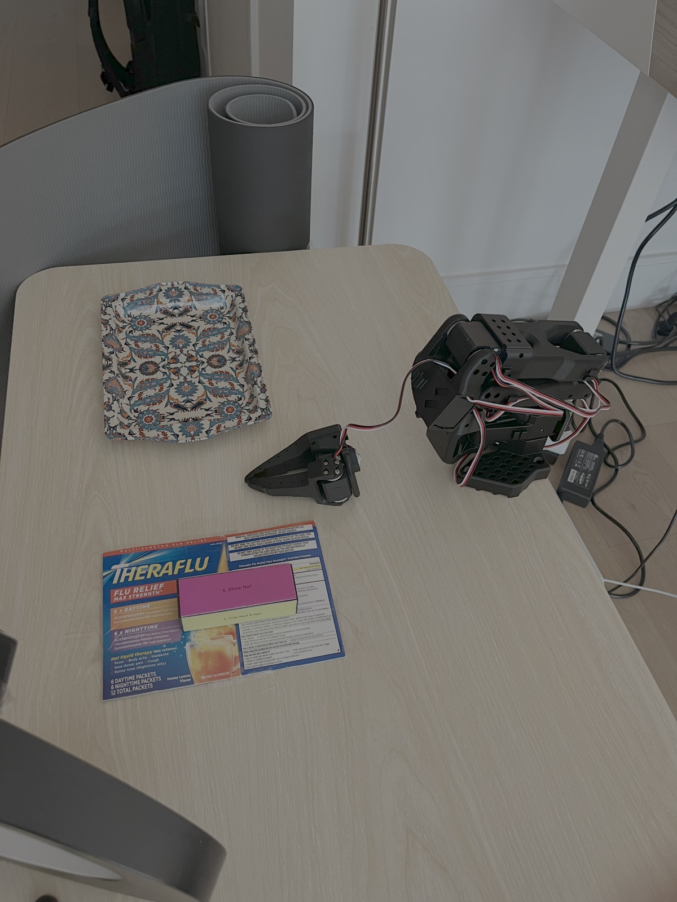
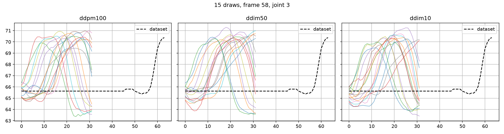

## Debugging diffusion violent motion that damaged the robot (offline action signal analysis)

First Diffusion attempt was a few weeks back. First line of issue we faced was inference time: ~9 s per chunk on my M1 Mac. Following the paper's own recipe ([Chi et al., 2023](https://arxiv.org/abs/2303.04137), §3.4), I cut the denoising steps at inference from the 100 used in training to 10 — DDIM lets you take larger denoising jumps with the same trained model. That brought inference to ~0.9 s, but on the arm the policy acted violently enough to physically damage it (gripper motor fell out). Full results in [results_diffusion.md](diffusion/results_diffusion.md). This writeup characterizes this violence and resolves it.

**Motivation.** The DDIM-10 hardware run was violent enough to detach the gripper motor. Before running this policy on the arm again, I wanted to answer "where does the violence come from?" offline by runing the checkpoint on recorded observations and measuring the action waveform, instead of finding out on hardware. Three candidate mechanisms to test: 
(a) Intra-chunk noise — coarse DDIM sampling makes the actions jump around from step to step within a single chunk
(b) Chunk-boundary seams — consecutive re plans disagree about where to go
(c) Sync stop-go timing — the arm moves ~1 s, freezes ~1 s while the next chunk computes, then snaps back into motion; each restart is a torque impulse, and hundreds per session can work screws and connectors loose. I wouldn't be able to get a confirmation that this is happening from data, but it is hypothesis if first two don't give us answers. 

**Method.** Notebook (`tools/diffusion_signal_analysis.ipynb`): 45 frames sampled mid-episode from the frozen training dataset. For each frame t, the policy predicts its full action chunk from exactly the observations it would have seen live (2-frame history for Diffusion, built via `delta_timestamps` to match the training time input format). From these we extracted:

- *Intra-chunk*: how much consecutive actions differ within a single predicted chunk 
- *Seam*: predict a chunk at frame t (chunk A), then predict a fresh chunk at t+n (chunk B, n_exec ∈ {8, 16, 32}) and measure the jump between where A left off and where B begins. This will tell us the consequtive chunk discontinuity commanded at every re-plan. Note - t+n observation comes from the demo trajectory (teacher-forced), i.e. this is a state a perfect executor would be in. In reality, arm has drifted off that trajectory during execution, so these seam numbers are a lower bound on the real ones.
- *Resample spread*: predict from the same frame 6 times and take the std across draws — since each call starts from fresh noise, this measures how much of any difference is just sampling randomness (the noise floor for the other two metrics).

All schedulers were compared on the same 45 frames (same seed): DDPM-100 (as trained), DDIM-50, DDIM-10 (the variant that ran on hardware). Two references alongside them: ACT, which is deterministic, and the per-step deltas of the demo data itself — the demos set the baseline for how smooth motion can be, so a scheduler matching them is as clean as it gets. Each scheduler variant is a copy of the checkpoint with only `config.json` edited, all sharing the same weights (the only override path that works — see the DDIM-10 note above). Before each run, a guard verifies the actually-loaded scheduler and step count, so every row in the table is what it claims to be.

**Pipeline notes** (recorded because each cost a debugging round):
- All the metrics in this writeup compare policies in degrees, but the policy networks don't operate in degrees — they take normalized inputs and produce normalized outputs, and the conversion in both directions lives in separate processor objects (`make_pre_post_processors`), not inside the policy. Hence, calling `predict_action_chunk` on raw dataset tensors returns something that is not usable for this analysis. So the notebook applies processors around every prediction, verified by checking that predictions on a training frame match the demo's ground truth in degrees.
- Diffusion's `predict_action_chunk` produces real Diffusion output, but its input handling assumes a single observation: it takes one frame and internally fabricates the 2-frame history the model expects. Hand it a correctly built (t−1, t) history and it breaks the shape instead of using it. So the notebook calls `diffusion.generate_actions` (layer below the wrapper) with properly stacked history, adding the batch dimension by hand (the preprocessor sees the extra history dimension and mistakes the input for an already-batched one).

**Results** (45 seam pairs, degrees; dataset floor: p95 = 1.85, max = 5.98 per step):

| policy   | intra d_p95 | seam n8 (mean) | seam n16 (mean) | seam n32 (mean) | worst seam | resample spread   |
|----------|------------:|---------------:|----------------:|----------------:|-----------:|-------------------|
| ACT      |        1.86 |           2.23 |            3.02 |            7.97 |       65.0 | — (deterministic) |
| DDIM-10  |        1.55 |           2.64 |            4.02 |            7.81 |       63.9 |              1.15 |
| DDIM-50  |        1.59 |           3.76 |            3.78 |           10.93 |       84.3 |              1.24 |
| DDPM-100 |        1.64 |           3.27 |            3.27 |            9.72 |       87.3 |              0.91 |

**Findings.**
1. **Intra-chunk noise is not the problem.** Every scheduler's per-step deltas are at or below the demo data's own — the sampling adds no jitter of its own.
2. **The violence lives in rare seam spikes.** Mean seams look harmless (3–11° across the table), but the damage comes from occasional large jumps concentrated at a few specific frames — up to 12–20° at n_exec=16 and 60–90° at n_exec=32. These are moments where the demo pauses or is about to move — the policy has several valid options for *when* to move, and two consecutive re-plans can pick different ones.
3. **More denoising does not fix it.** The spikes sit at the same frames across DDIM-10, DDIM-50 and DDPM-100 — and ACT shares the same hot frames at comparable magnitude. This is the trained model being uncertain at ambiguous moments, not a DDIM-10 sampling artifact — so a faster GPU with more denoising steps was never going to solve it.
4. **Seams grow with commitment length.** Mean seams: ~2–4° at n_exec=8, ~3–4° at 16, ~8–11° at 32 — for every policy, ACT included. This is expected: errors compound the longer the chunk runs open-loop, so the further past its observation a plan executes, the further its tail lands from where a fresh re-plan begins. One caveat on the worst n=32 seams: they are dominated by a frame where *all* policies predict a dive the reference demo doesn't make at that moment — a timing-ambiguous state, so the teacher-forced seam there partly measures disagreement with one demo's timing rather than a jump a live arm would be commanded through.
5. **Why do consecutive re-plans disagree?** 15 draws per scheduler from one identical observation: every draw does the same bump, but at a different time — some move immediately, some hold for 10–20 steps first. Two consecutive chunks are two such draws, and when they pick different timings, the handoff between them is the seam. The spread looks the same across all three schedulers — matching finding 3: this is the model, not the sampler (see image below).

**Plan for deployment.**
- **Clamp the motion.** The spikes come from the model itself, so no scheduler or GPU change removes them — and the worst commanded jumps are far above any reasonable per-step motion. Let's start with `max_relative_target=5`, so a large one-step request becomes at most 5° per tick.
- **Target config: remote GPU + clamp, starting at n_exec = 32.** Keep n_exec = 32 at first — with horizon 64 that's the paper's own predict/execute ratio of 2 — and use `chunk_size_threshold` to request re-plans earlier within it, checking whether seams shrink on hardware. If they do, drop n_exec further (16, then 8): the offline table says shorter commitments mean smaller seams. The constraint is duty cycle: executing 8 steps takes 0.27 s, and on the M1 inference takes ~0.9 s (DDIM-10) — the arm would wait ~3× longer than it moves. So, as with SmolVLA, move inference to the remote A10 (~0.1 s per chunk + box round-trip) to keep the "doing" vs "waiting" ratio workable at short commitments.

All data and analysis: metrics in [`results/diffusion_signal/signal_metrics.csv`](results/diffusion_signal/signal_metrics.csv), figures in [`signal_summary.png`](results/diffusion_signal/signal_summary.png) and [`resample_overlay_f58.png`](results/diffusion_signal/resample_overlay_f58.png), notebook in [`Diffusion_Signal_Analysis.ipynb`](Diffusion_Signal_Analysis.ipynb).

## Running inference for diffusion on cloud

**Setup.** Remote inference for Diffusion via the async client/server path (A10 box, SSH tunnel), extended for diffusion's 2-frame observation history: the client pairs each sent observation with the frame captured 1/30s earlier (a rolling one-tick buffer; at episode start the first frame is duplicated, matching sync warm-up), and the server stacks [prev, cur] before inference, calling `generate_actions` directly — the stock `predict_action_chunk` fabricates a fake single-frame history and cannot serve n_obs_steps=2.

**Mac ↔ GPU data path** (each patch forced by a measured failure):
- Sending raw paired frames to the GPU box is ~1.8 MB per send, and since sending was synchronous, the 30 Hz control loop froze 280–400 ms every send. Fix 1: compress to JPEG (quality 90, ~120 KB) — freezes down to 80–180 ms, but still there.
- Fix 2: move sending to a background thread with a 1-slot queue where the newest frame overwrites the old one (the arm should always act on the freshest image, not work through a backlog). Control loop settled at 3–7 ms, frame spacing locked at ~0.033 s. Both fixes are needed: JPEG makes the payload small enough, the thread gets sending off the control loop entirely.
- To confirm this surgery wasn't distorting anything, I ran a training frame through the full path — JPEG round-trip, server prep, policy — and compared against the clean offline prediction and ground truth: agreement to 1.85° max.

**Adjusting inference parameters on the real arm.** 
- **Clamp (DDIM-10):** at clamp = 15 arm travels violently — this is regime that broke it. At 5 it never even gets up, the arm wiggles in place. So ideal clamping is somewhere in the middle, but the motion never looked smooth, so we ditched DDIM-10 and tried to go for higher sampler.
- **Effective horizon tuning (DDIM-10):** offline analysis said shorter commitments mean smaller seams, so I kept n_exec = 32 (for horizon = 64, 2x smaller like paper) but swept `chunk_size_threshold` from 0.8 (request a new chunk after ~6 executed steps) down to 0.0 (execute all 32). Note: an early request is not an early swap — with ~0.5 s of inference + round-trip, the arm executes another ~13–15 steps before the new chunk lands. So even the most aggressive threshold commits ~20 steps; the short regime from the offline analysis was unreachable in sync. Threshold 0 actually looked better than 0.8, and in hindsight it makes sense: at 0.8 each new chunk is planned from a ~0.5 s-old mid-motion observation, at 0 the arm is standing still when it's planned. Since latency blocks short commitments either way, full chunk was the right sync choice — short commitments with fresh observations is exactly what async gives.
- **Sampler:** DDIM-50 (same checkpoint, config.json edit, ~0.43 s/chunk on the A10) is where motion got smooth — approach and near-grasp at clamp 10. To make sure the improvement was the sampler and not the clamp, I reran DDIM-10 at clamp 10: still rough. Clamp bracket around DDIM-50: 8 the cleanest, 5 and 10 slightly rougher. Arm was able to pickup box from the center of the starting region 2/3 attemps. 
- **DDPM-100** (~0.83 s/chunk) ran fine as machinery but barely moved the arm — most inter-draw variety, so full chunks of bump-and-return draws plus ~1 s pauses add up to nothing. Best sampling fidelity ≠ best deployment.

**Frozen eval config:** DDIM-50 · `max_relative_target=8` · `chunk_size_threshold=0.0` (full-chunk sync semantics) · `latest_only` · paired observations · JPEG 90 · remote A10. ~0.43s think-pause per 1.07s chunk — same duty class as the SmolVLA remote eval. The clamp is part of Diffusion's deployment requirements (ACT and SmolVLA run unclamped)