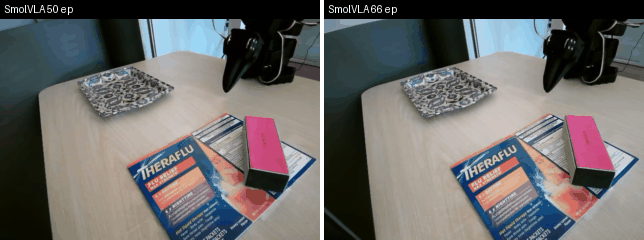

# SmolVLA trained on old + extra 16 demo data (nominal test - 20 trials)

- **Date:** 2026-09-01
- **Policy:** SmolVLA, checkpoint 100000 (`checkpoints_smolvla_v2_66ep/100000`)
- **Dataset trained on:** `TamaraSumarac/so101_policy_robustness_v2` @ `801d245` (66 episodes: 50 original + 16 supplement; 36266 raw → 26306 trimmed frames per `trim/trim_frames_v2.json`)- **Deployment:** `lerobot-rollout`, strategy=episodic, inference=sync, device=mps, 30 fps
- **Protocol:** fixed 5-position × 4-orientation grid (frozen for all policies); binary success = block at rest fully within plate rim; all trials scored, no discards; episode budget 30 s
- **Rollout dataset:** `TamaraSumarac/rollout_smolvla_v2_ep66_nominal_eval` (local only)
- **Episode mapping:** scored trials = episodes 0–19 (no warm-up)
- **Block orientation:** pink faces up, yellow faces toward window at 0° (matches standard block placement)

| Trial | Start cell                                   | Success (0/1) | Failure note (one phrase)                                                                            |
|-------|----------------------------------------------|---------------|------------------------------------------------------------------------------------------------------|
| 1     | Center, yellow side window, 0 degrees        | 1             |                                                                                                      |
| 2     | Top left, yellow side window, 0 degrees      | 0             | pushed block around                                                                                  |
| 3     | Top right, yellow side window, 0 degrees     | 1             | very close on first try, worked on 2nd try                                                           |
| 4     | Bottom left, yellow side window, 0 degrees   | 1             |                                                                                                      |
| 5     | Bottom right, yellow side window, 0 degrees  | 0             | was very close positionally on first and 2nd try                                                     |
| 6     | Center, yellow side window, 45 degrees       | 1             |                                                                                                      |
| 7     | Top left, yellow side window, 45 degrees     | 0             | tipped it on the first try, was positionally a bit off                                               |
| 8     | Top right, yellow side window, 45 degrees    | 0             | pushed it on first try a bit off, angle was good, position slightly off                              |
| 9     | Bottom left, yellow side window, 45 degrees  | 1             |                                                                                                      |
| 10    | Bottom right, yellow side window, 45 degrees | 1             |                                                                                                      |
| 11    | Center, yellow side mirror, 90 degrees       | 1             | tipped it on pickup                                                                                  |
| 12    | Top left, yellow side mirror, 90 degrees     | 0             | wrist angle wrong and position slightly off, but i think wrist angle a bit better than before        |
| 13    | Top right, yellow side mirror, 90 degrees    | 0             | very close on first try, position slightly off, wrist angle good                                     |
| 14    | Bottom left, yellow side mirror, 90 degrees  | 0             | tipped it on first try and then was positionally next to the block                                   |
| 15    | Bottom right, yellow side mirror, 90 degrees | 0             | wrist angle good, position slightly off, tipped it on 2nd try                                        |
| 16    | Center, yellow side door, 135 degrees        | 1             | fell out of grasp but picked it up cleanly with good wrist angle                                     |
| 17    | Top left, yellow side door, 135 degrees      | 0             | wrist angle slightly off on first try, then off for 2nd attempts                                     |
| 18    | Top right, yellow side door, 135 degrees     | 1             |                                                                                                      |
| 19    | Bottom left, yellow side door, 135 degrees   | 1             |                                                                                                      |
| 20    | Bottom right, yellow side door, 135 degrees  | 1             |                                                                                                      |

## Result

- **Successes:**  11 / 20
- **Nominal success rate:**  55%

## Observations 
- Significant improvement (35% → 55%) from only 16 additional demos — and none of them were recorded at the positions or angles tested here.
- More importantly, the wrist angle has clearly improved. This is easiest to see on the bottom left 135° cell (trial 19), where the side by side GIF shows the new model adjusting the angle correctly while the old one doesn't

