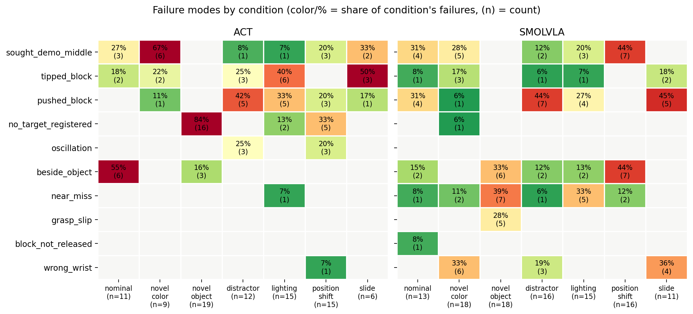
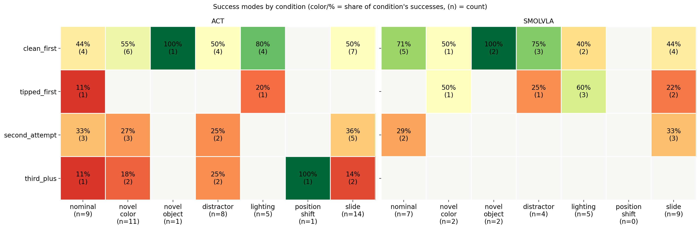
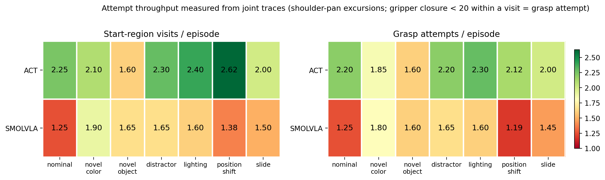

## Key results:

* **Novel color:** Affected SmolVLA more than ACT, suggesting that SmolVLA conditions more strongly on color (consistent with color being explicitly included in its task string).
* **Novel object:** Affected ACT more than SmolVLA. Combined with the novel color result, this suggests that ACT relies more on object shape, while SmolVLA relies more on color and its task string input.
* **Distractors:** Consistent with the color and object findings, SmolVLA degraded more in the presence of a pink distractor than ACT, although ACT was not fully immune to it either.
* **Lighting:** Affected both policies, though SmolVLA was somewhat more robust and had many near-misses (5/15). This was expected given its much larger visual pre-trained prior and likely exposure to a wider range of lighting conditions.
* **Position shift:** Suggests that training data coverage is a major constraint on pickup accuracy. SmolVLA appears to register the object's new location better than ACT, but its "body" acts somewhat "unaware" of how to execute the motion needed to pick up an object in a position it has never seen during training.
* **Object slide:** Further supports the position shift findings. SmolVLA shows better visual adjustment to changes in object position, while ACT operates more on "autopilot," moving its arm toward a familiar location (typically near the middle of the training region). It sometimes succeeds accidentally after pushing, dragging, or tipping the object into that region during previous pickup attempts.

## Results of failure analysis:
If we look at failure modes in aggregate across ACT and SmolVLA, we see three clear behaviors:

* **Shared failure modes:** Both policies consistently make the same three mistakes: `sought_demo_middle`, `tipped_block`, and `pushed_block`. I believe all three are consistent with limitations in training data representation. Tips and pushes often happen when arm is close to object but not exactly there on first try, it accidentally creates contact with the object and moves it toward a more familiar position, while `sought_demo_middle` is an even clearer consequence of the training distribution.

* **ACT — weaker visual registration:** ACT shows more `no_target_registered` and oscillation behavior than SmolVLA, both consistent with ACT's visual model being less capable of detecting and adapting to novel objects/positions. Oscillation happens when ACT registers that there is no object in the starting region and also registeres there is no object in the target tray region, causing it to hover between the two without success (oscillation also occured in distractor measurements when ACT looks like it registered two objects at two distinct locations).

* **SmolVLA — more "almost successes":** SmolVLA has many more `beside_object`, `near_miss`, and `grasp_slip` failures, particularly the latter two. These dominate especially in the novel object experiment, where SmolVLA's visual model appears to work well, but its action model may be less successful at executing the pickup than ACT's more "autopilot" behavior.

* **SmolVLA — wrist orientation:** SmolVLA also shows a unique `wrong_wrist` failure. Its gripper orientation often reverts toward angles closer to 0°, which are better represented in training, while ACT adjusts wrist orientation more successfully. This suggests that SmolVLA may be overfitting specifically to the wrist orientations seen during training. This also makes me think whether SmolVLA's action part of the model could improve and be more successful like ACT's one is.

## Results of success analysis:
Success modes by policy reveal a striking difference. Comparing ACT and SmolVLA side by side, and separating clean first-attempt successes from more "dirty" successes — including first attempt tipping and second/third attempt pickups - ACT shows substantially more second/third attempt successes than SmolVLA. From the videos, SmolVLA also tends to get closer to the object on subsequent attempts, similar to ACT, but ACT's greater engagement with the object may ultimately make it more successful.

One question I have is whether this could be a consequence of SmolVLA's longer inference time. With inference ~3× slower than ACT (~1 s vs. ~351 ms), SmolVLA looks like it is effectively getting fewer pickup attempts within the same episode duration, which could potentially be reducing its overall success rate. Note this is a different claim from the slide result — there latency didn't change what SmolVLA did (it still re-targeted), here the question is whether latency is affecting "how much policy does" (i.e. how many attempts it gets). 

To confirm/refute this hypothesis I analyzed the raw joint data, tracking the shoulder_pan position and gripper opening — counting how many visits each policy made between the starting region and the target tray region (shoulder pan above 35 = entered the start region, below 25 = headed back toward the tray), and how many pickup attempts it made within those visits (gripper closing below 20). This analysis shows that ACT indeed makes many more attempts per episode (2.25 vs 1.25 grasp attempts on nominal), suggesting that shorter inference latency does buy more pickup attempts within the episode budget. Interestingly, per individual attempt, SmolVLA actually converts at a similar or better rate per attempt than ACT (7 successes / (1.25 attemtps x 20 episode) = 0.28 for SmolVLA vs 9 successes / (2.25 attempts x 20 episodes) = 0.20 for ACT ), suggesting that ACT wins on attempt volume, not attempt quality.  This suggests that if SmolVLA's inference was faster, which could be achieved with
LeRobot's async inference feature, we would get more pickup attempts from SmolVLA, which at its current conversion rate should result in a higher success rate.

## Pre data collection hypotheses vs outcomes

All hypotheses were written down before any grid trials ran (see perturbation_protocol.md).

### Position shift
Prediction was that both policies would struggle in these new regions, as they are far outside the training distribution, with ACT potentially generalizing worse than SmolVLA. However, both policies recognize that the object is outside the trained region and attempt to adjust toward it. During pickup, they tend to go to positions seen during training, often attempting to grasp object in the starting region adjacent to the object's actual location, as if their vision identifies the object's rough location but their "body" cannot follow because that particular action is unfamiliar. This behavior is pronounced for SmolVLA. ACT is somewhat different because it occasionally collides with the object, accidentally pushing or dragging it closer to the trained starting region, where it is more likely to be picked up successfully.

### Novel color
Prediction was that SmolVLA would be more affected by the new color than ACT. This ended up being true: ACT performance was unaffected (45% → 55%), while SmolVLA degraded significantly (35% → 10%). This suggests that ACT may rely more on the object's shape (which is also confirmed by novel object measurement, see below), while SmolVLA, which also takes the task string as input, might be overindexing on color more than I would have hoped ("pink block" is explicitly included in the task description). This SmolVLA hypothesis could be tested by repeating the novel color experiment with SmolVLA, but changing the task description to match the color of the new object.

### Distractor
Hypothesis was that ACT would ignore the sock and SmolVLA would be more distracted, because the sock is pink and color is important conditioning for SmolVLA. It is true that SmolVLA was more distracted. However, it is not true that ACT was unaffected — oscillation mode registered for ACT (3 failures at locations where target object was close to distractor) says it is also registering the distractor. 

### Lighting
Hypothesis was that both policies would degrade, but SmolVLA might be more robust due to its pre-trained prior having seen a wider range of lighting conditions. This predition turned out to be true (ACT 45%→25%, SmolVLA 35%→25%) with SmolVLA also showing many failures that were near_miss.

### Novel object
Hypothesis was that SmolVLA would adjust to a new object better than ACT, given its pre-trained prior. This is exactly what was observed. ACT's most common failure mode was not registering the new object at all (no_target_registered, 16/19 failures), whereas SmolVLA's common failures were near_miss, beside_object, and grasp_slip — all saying it registers and approaches the object, failing either at precise localization (near_miss, beside_object) or at the grasp itself (grasp_slip).

### Cube slide
Hypothesis was that ACT would operate more on "autopilot," going toward the middle of the demo region, while SmolVLA would be better at adjusting to the new position given its expected better "understanding" of the visual world. This is what we observed. One question we had before the measurement was whether inference latency could affect performance, but ACT replans ~3× faster (~351 ms vs ~1 s) and still did not adjust to shifted object, suggesting that representation, rather than reaction time, is the more important constraint. Note that success rates in this column are inflated for both policies, as slides moved the block toward more middle of the starting region territory (mostly seen in training).