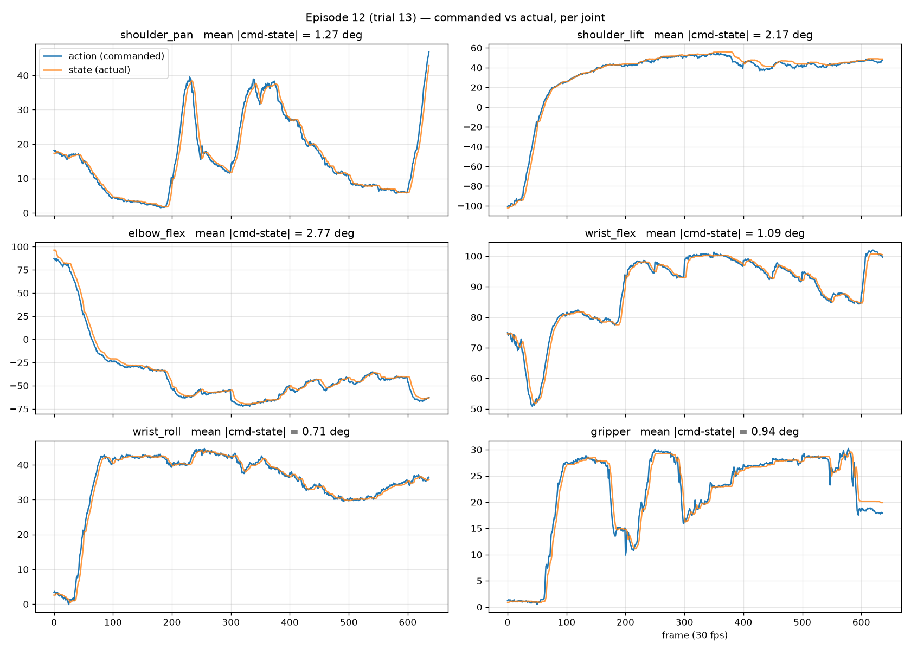
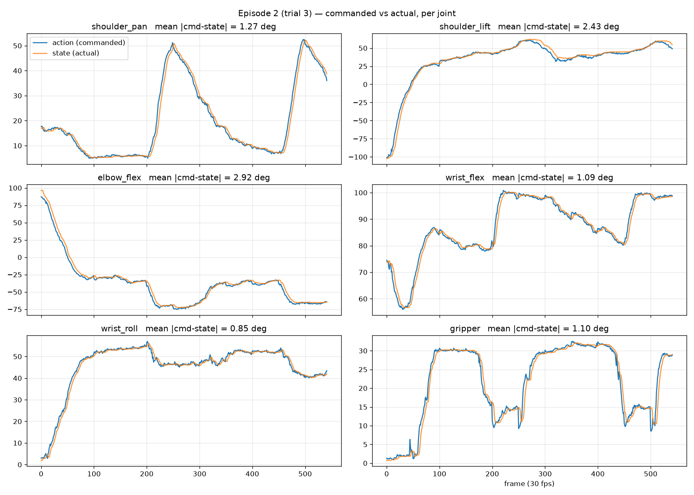
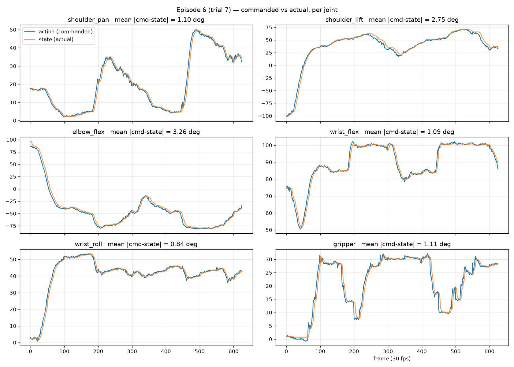
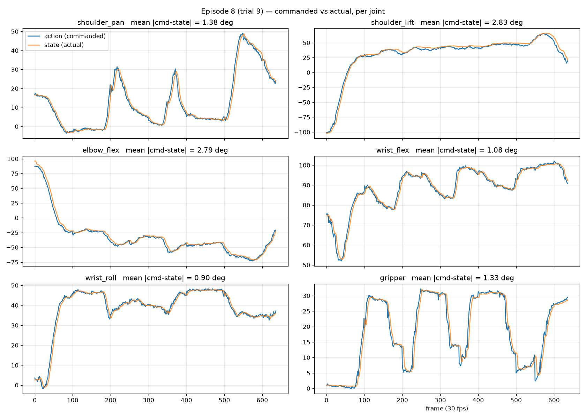
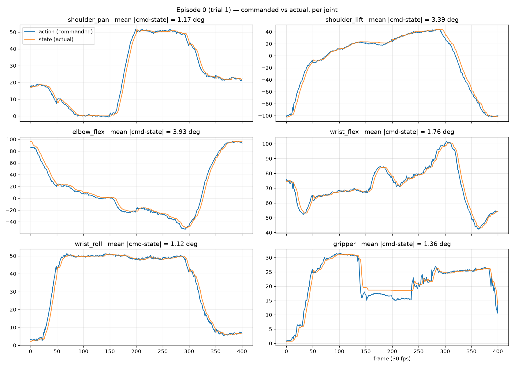

## TLDR
- Nominal success: 7/20 (35%) on frozen 5×4 grid, 30 s budget
- Checkpoint: 100000 (final), dataset @ e2dd884 (trimmed)
- Verdict: GO - proceed to Diffusion Policy

## Failure categories — 13 failed trials (one per trial = earliest event the trial did not recover from, judged from video)

| Category            | Definition                                                                                       | Count | Trials                    |
|---------------------|--------------------------------------------------------------------------------------------------|-------|---------------------------|
| reached wrong spot  | gripper descended/closed at a visibly wrong location (e.g. went to middle, gripper tip on block) | 8     | 3, 5, 7, 8, 9, 10, 18, 19 |
| closed on nothing   | gripper at roughly the right spot, but fingers closed without securing block (air/edge)          | 0     |                           |
| tipped block        | contact tipped or knocked the block over instead of grasping it                                  | 2     | 12, 17                    |
| pushed block away   | contact pushed the block out of the start region / out of camera view                            | 2     | 14, 15                    |
| dropped in transit  | block secured, then lost between pickup and plate                                                | 0     |                           |
| missed plate        | block carried and released, but came to rest outside/on the rim of the plate                     | 0     |                           |
| never moved/stalled | arm froze or never approached                                                                    | 0     |                           |
| block not released  | block picked up but never released                                                               | 1     | 13                        |

**Observation:** failure categories are similar to ACT's, with one addition: block not released (trial 13) — on its last attempt the block was picked up and transported to
the target, but likely with too little budget left for the release, so the arm returned to its start position with the block still in hand. Overall, SmolVLA's positioning looked better than ACT's: in every wrong-spot failure outside the 90-degree row, the gripper actually touched the block — it was just slightly off, and would often drag the block instead of grasping it. Its wrist angle, on the other
hand, seemed less well adjusted than ACT's. As with ACT, all failures happen before the fingers close: no drops, no missed plates.

**Recovered trials (failed attempt(s), then succeeded within budget) — not in tally above:**
- Trial 2: initial position slightly off; a gripper finger dragged the block toward the middle, which made the next pickup attempt easier
- Trial 4: same as trial 2, except the block also got tipped along the way

## Failure category × position (13 failed trials; cell = count)

| Position     | reached wrong spot | tipped block | pushed block away | block not released | Total failed |
|--------------|--------------------|--------------|-------------------|--------------------|--------------|
| Center       |                    |              |                   |                    | 0/4          |
| Top left     | 1                  | 2            |                   |                    | 3/4          |
| Top right    | 3                  |              |                   | 1                  | 4/4          |
| Bottom left  | 2                  |              | 1                 |                    | 3/4          |
| Bottom right | 2                  |              | 1                 |                    | 3/4          |

## Failure category × orientation (13 failed trials; cell = count)

| Orientation | reached wrong spot | tipped block | pushed block away | block not released | Total failed |
|-------------|--------------------|--------------|-------------------|--------------------|--------------|
| 0°          | 2                  |              |                   |                    | 2/5          |
| 45°         |                    | 1            | 2                 | 1                  | 4/5          |
| 90°         | 4                  |              |                   |                    | 4/5          |
| 135°        | 2                  | 1            |                   |                    | 3/5          |

## Commanded vs actual traces (policy error vs tracking error)

To determine whether failures come from the policy commanding wrong actions or the
controller failing to execute them, commanded action was overlaid against observed
state per joint for representative episodes (`plot_traces.py`).

**Episode 12 (trial 13 — top right, 45°, block not released):** tracking is doing a good job: mean |command − state| between 0.7° and 2.8° across all six joints, with
state following command at a small consistent lag. The retry texture differs clearly from ACT: instead of ACT's three full excursions (commit, retreat, re-approach),
shoulder_pan makes an attempt around frame ~230 and then stays in the block's neighborhood (~frames 300–370) while the gripper cycles open/close until the grasp
lands — local adjust-and-regrasp rather than retreat-and-reapproach.

The never-released block is directly visible in the gripper trace: from ~frame 590 to the end of the episode, command (~18) and state (~20) hold a sustained offset —
the same grasp-force signal that in ACT's reference episode vanished at release — while shoulder_pan sweeps back toward the start position. The arm went home with the
block still in hand, readable from the data alone.

Both hardware envelope patterns appear here as well (shoulder_lift's transient lag during the loaded reach, wrist_flex riding its ~100° limit), consistent across these two architectures with these being properties of the hardware, not of failures.

**Episode 2 (trial 3 — top right, 0°, reached-wrong-spot):** tracking again good (mean |command − state| 0.9–2.9° across joints). The attempt structure differs from
ACT's wrong-spot episodes: instead of several short committed excursions, shoulder_pan makes two long engagements (~frames 200–450 and ~500 on). The
video shows the approach arriving slightly off and the gripper pushing the block during the close; consistent with the ACT  finding, the push leaves no signature
in the command–state gaps — the block is too light to load the servos. Position was near-miss: the gripper reached and touched the block, just
off the graspable point — the dominant flavor of SmolVLA's wrong-spot failures outside the 90° row.

**Episodes 6 and 8 (trials 7, 9 — top left / bottom left, 90°, both reached-wrong-spot):** direct comparison with ACT's 90° failures. Both fail the cell the same way at the
top level — approach pulled toward the training mode, wrong grasp point — so the 90° wrong position is data-driven and architecture-independent. The retry path structure,
however, differs consistently: ACT retries are stereotyped (near-identical committed excursions at a regular cadence — ep 13's three passes to the same ~50° neighborhood,
ep 16's metronomic cycles — with rapid gripper open/close each pass); SmolVLA's are heterogeneous — ep 6 spends its budget in two long adjusting engagements, ep 8 makes
three unequal excursions — with fewer, longer gripper engagements per approach. State vs action tracking is good here as well.

**Episode 0 (trial 1 — center, 0°, success; reference):** the success anatomy matches ACT's reference exactly: one committed approach, the gripper's sustained command–state
offset appearing at pickup (~frames 150–240) — the block's width blocking commanded closure — and vanishing at release. Tracking tight throughout (0.9–3.9° mean gaps,
elbow's 3.9° during the fast loaded sweep). The path, though, differs from ACT consistently with every other episode pair: ACT's success is ballistic — clean sweeps,
minimal correction, task done in ~11.5 s with the arm parked for the remaining budget, while SmolVLA's is slower and correction-dense, small adjustments running through the
entire approach and transport, finishing near the budget's end. Part of this is deployment (~1 s chunk-boundary pauses); part appears to be the policy's native motion
texture, the same heterogeneous adjusting style visible in its failures.

**Takeaway:** as with ACT, failures are policy errors, not tracking errors — the control stack executes commanded trajectories with degree-level fidelity (0.7–3.9°
across all episodes examined), and in failed trials the commands themselves direct the gripper to the wrong location. This localizes the problem in the learned policy /
training data, not in deployment. Beyond that shared verdict, the traces show a clear path-level difference between the two policies: ACT's trajectories closely mimic
teleoperation — clean, committed, demo-like sweeps executed at a fixed cadence — but adjust to situations somewhat worse; SmolVLA's are heterogeneous — slower,
correction-dense, no two attempts alike — giving the visual impression of a policy that is adjusting as it goes rather than replaying what it learned by heart. The same
contrast appears in successes and failures alike, making it a consistent signature of the two architectures rather than a property of any single episode.

## Interpretation

Traces rule out deployment (as for ACT): commands executed with degree-level fidelity, so the failures are about what the policy learned from the training data.

**Seeking for middle position survived pretraining.** 8/13 failures are reached wrong spot, and 90° row failed 4/4 with the same center-seeking signature as ACT's. 
The pretrained visual prior did not fix data-coverage gravity.

**Position better, orientation worse — the two policies fail on different axes.** Outside the 90° row, every wrong-spot failure actually reached and touched the
block — near-misses, not completely off position — better positioning than ACT. But wrist angle adjustment is weaker: several blocks that were reachable got pushed or
tipped because the gripper angle didn't match the block. 

**Everything still fails before or at the grasp; one new post-grasp category.** 0 drops, 0 missed plates — but trial 13 added grasped-never-released (block
carried home in hand).

**Retry style is architecturally distinct.** ACT retries by repetition (stereotyped excursions, rapid gripper cycling); SmolVLA retries by heterogeneous
continuation — longer engagements, fewer and longer gripper cycles, no two attempts alike — and this texture is consistent across successes and failures.

**Did pretraining help?** By success rate, no: 35% vs ACT's 45% is within measurement noise at 20 trials. What changed is *how* the policy behaves: better
aim at the block's position, worse wrist-angle handling, slower motion. Both models fail differently but hit the same ceiling at the same places
(off-center, rotated blocks) — pointing at the training data as the limit, not the architecture. Decisive test: record extra demos at the failing spots, retrain, see
if those cells recover (ideas.md).

## Note: camera slot mapping (single-camera fine-tune of a multi-camera pretrained model)

`lerobot/smolvla_base` was pretrained on community robot datasets with three camera
views, expected under the feature names `observation.images.camera1/2/3`. Our rig has
a single camera (`observation.images.front`). At launch, the dataset's camera was
mapped onto the first expected slot via
`--rename_map='{"observation.images.front": "observation.images.camera1"}'`;
the remaining views are handled as absent, per SmolVLA's variable-camera design
(the architecture was built for heterogeneous community data where camera counts
differ across datasets).

Two implications worth keeping in view when reading SmolVLA's results:
1. **This is the first structural asymmetry of the three-way comparison.** ACT and
   Diffusion Policy were constructed *around* this dataset's features; SmolVLA
   arrives with expectations inherited from pretraining that the dataset must be
   adapted into. That is not a bug — it is the cost side of the pretrained-prior
   trade this comparison exists to measure.
2. **The pretrained visual prior is being consumed under narrower conditions than
   it was formed.** The model's pretraining saw multi-view scenes; our fine-tune
   shows it one view in slot 1 with the others empty. If SmolVLA underperforms,
   "prior formed on three views, deployed on one" is a candidate explanation to
   weigh alongside the usual ones — and if it outperforms ACT's task-trained
   vision anyway, the result is stronger for it.